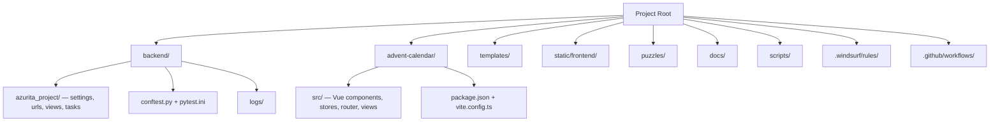

# Directory Structure

**Key invariants:**
- Frontend lives in `advent-calendar/` (NOT `frontend/`). Built with Vite to `static/frontend/`.
- Django project module is `azurita_project/` (NOT `projectapp/`).
- `manage.py` and `venv/` are at the repo root, not inside `backend/`.
- `puzzles/` is a stub Django app — no business logic yet.
- `static/frontend/` and `backend/db.sqlite3` are gitignored generated artifacts.
