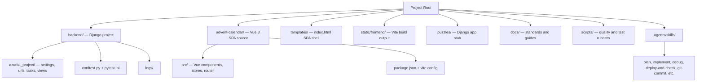

# CLAUDE.md

This file provides guidance to Claude Code (claude.ai/code) when working with code in this repository.

## Source Of Truth
- The canonical repo guidance is maintained in the Codex-native surfaces: `AGENTS.md`, `backend/AGENTS.md`, `.agents/skills/*`, `.codex/config.toml`. There is no `frontend/AGENTS.md` for Azurita because the frontend lives in `advent-calendar/`, not `frontend/`.
- This `CLAUDE.md` file is a compatibility mirror for mixed-tool teams and should stay aligned with the Codex guidance.
- Project-level context lives in `README.md`, `BUILD.md`, and `docs/`. Memory Bank is at `docs/methodology/` + `tasks/`.

## Project Overview
- **What it is**: an interactive advent-calendar / daily-puzzles experience.
- **Stack**: Django 5.2 + DRF (backend, mostly an SPA shell + Huey schedule) / Vue 3 + TypeScript + Vite (frontend in `advent-calendar/`) / SQLite / Redis / Huey / GSAP + Tailwind for animation/UI.
- **Production path**: `/home/ryzepeck/webapps/azurita`.
- **Services**: `azurita.service` (Gunicorn), `azurita-huey.service`.
- **Environment**: staging-class workload. SQLite at `backend/db.sqlite3`. SMTP not used.
- **Frontend output is served by Django** through `templates/index.html` + the catch-all `index` view.

## Directory Structure



- `manage.py` and `venv/` live at the **repo root**, not inside `backend/`.
- `static/frontend/` and `backend/db.sqlite3` are gitignored generated artifacts.

## Architecture Invariants
- The backend has **no business-logic Django app** yet. `puzzles/` is an empty stub. New business logic should either land in `puzzles/` or in a new app under `backend/`.
- The single existing view (`azurita_project.views.index`) renders `templates/index.html`. When adding API endpoints, prefer **function-based views with `@api_view`** for consistency.
- The frontend lives in `advent-calendar/` (Vue 3 + TS + Vite). Do **not** create a `frontend/` directory or move things into it.
- Settings are split into `azurita_project/{settings,settings_dev,settings_prod}.py`. `DJANGO_SETTINGS_MODULE` is always `azurita_project.settings`; production mode is activated by `DJANGO_ENV=production` (which auto-imports `settings_prod.py`). Never use `settings_prod` as the module directly.
- `huey.contrib.djhuey` is used; tasks live in `backend/azurita_project/tasks.py`. In dev, `HUEY['immediate']=True` so no worker is needed.
- `django-silk` is gated behind `ENABLE_SILK=True` env var. Off by default.

## Architecture Patterns

**Minimal backend, SPA-heavy frontend** — The Django backend serves a single `index` view that renders the Vue SPA shell. All product behavior lives in `advent-calendar/`. The catch-all URL pattern routes any non-`/admin/`, non-`/api/`, non-`/silk/` request to Vue Router.

**SPA shell pattern** — `templates/index.html` is the only Django template. It uses `` and injects the Vite-built JS/CSS bundles from `static/frontend/assets/`. Build flow: `npm run build` → `static/frontend/` → `collectstatic` → nginx + Gunicorn serve.

**Huey periodic tasks** (all in `backend/azurita_project/tasks.py`):
- `scheduled_backup` — Mon 03:00 UTC (DB snapshot via `django-dbbackup`, last 4 retained in `/var/backups/azurita`)
- `silk_garbage_collection` — daily 04:30 UTC (gated by `ENABLE_SILK`)
- `weekly_slow_queries_report` — Thu 07:00 UTC (Markdown under `backend/logs/silk-reports/`)
- `silk_reports_cleanup` — 1st of month 05:45 UTC (purges reports older than 6 months)

## Working Rules
- Prefer existing project patterns over generic framework advice.
- The repo is Django-light: don't fabricate apps, models, or services that aren't there. Read first.
- Do not change old migrations; add new migrations when schema changes are required.
- Keep security basics intact: validated serializer inputs, ORM-first queries, escaped rendering, CSRF/session boundaries, and no secrets in code.

## Commands

```bash
# Activate venv (from repo root — venv/ lives here, not in backend/)
source venv/bin/activate

# Backend dev server
python manage.py runserver

# Backend lint
ruff check backend/

# Make and apply migrations
python manage.py makemigrations <app>
python manage.py migrate

# Frontend dev server (Vite, default :5173)
npm --prefix advent-calendar run dev

# Frontend build (emits to static/frontend/)
npm --prefix advent-calendar run build

# Frontend lint
npm --prefix advent-calendar run lint

# Collect static for production
python manage.py collectstatic --noinput

# Backend tests — always specify files, never run bare pytest
pytest backend/path/to/test_file.py -v
pytest backend/path/to/test_file.py --no-cov  # fast, skips coverage
```

## Testing
- **Never run the full test suite.** Always specify files.
- Maximum **20 tests per batch**, **3 test commands per cycle**.
- `pytest.ini` at `backend/pytest.ini` sets `DJANGO_SETTINGS_MODULE=azurita_project.settings` and adds `--cov=azurita_project --cov-branch` by default — pass `--no-cov` for fast iteration.
- Frontend (Vue 3 SPA in `advent-calendar/`): **no test suite yet**. When added: `npm --prefix advent-calendar test -- path/to/file.spec.js`.
- E2E: not yet established.

**Quality rules** (full reference: `docs/TESTING_QUALITY_STANDARDS.md`):
- Each test verifies **one specific behavior** — no conjunctions in test names.
- Follow **AAA pattern**: Arrange → Act → Assert.
- Assert **observable outcomes** (status codes, DB state, rendered UI).
- Mock only at **system boundaries** (external APIs, clock, email). No DB mocks.

## Production Deployment

```bash
# 1. Build frontend
npm --prefix advent-calendar run build

# 2. Collect static
python manage.py collectstatic --noinput

# 3. Restart services
sudo systemctl restart azurita && sudo systemctl restart azurita-huey

# 4. Verify
bash /home/ryzepeck/webapps/ops/vps/scripts/deployment/post-deploy-check.sh azurita
```

See `.agents/skills/deploy-and-check/SKILL.md` for the canonical sequence.

## Quality Tooling
- `scripts/test_quality_gate.py` — semantic test-quality analyzer (assertions, mocks, selectors) run alongside Ruff lint.
- `scripts/run-tests-all-suites.py` — multi-suite orchestrator (backend-focused until frontend tests are added).
- `.pre-commit-config.yaml` — pre-commit hooks at repo root.
