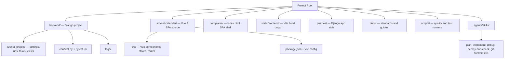

<!-- fleet-base:begin v=1 -->
# CLAUDE.md — Azurita (`azurita`)

Esta seccion es la **base comun del fleet** y se sincroniza desde
`vps-ops-toolkit/workflows/.claude/base/CLAUDE.md.tmpl`. No editar manualmente:
los cambios se pierden en el proximo sync. Para customizar este proyecto, usar
la seccion `project-specific` mas abajo.

## Convencion de lenguaje

- Codigo, identificadores y nombres de variable: **ingles**.
- Mensajes de commit: **ingles** (Conventional Commits).
- Docs operativos, skills y reportes: **espanol** (terminos tecnicos en ingles donde son de uso corriente).
- Mensajes de error visibles al usuario final: idioma del proyecto.

<!-- session-start-protocol:begin -->
## Session Start Protocol

Al inicio de **cada sesión y antes de editar archivos**, debes invocar la skill `git-sync` para este repo. Razón: el operador trabaja desde múltiples máquinas y procesos automatizados (cron, CI) pueden haber commiteado cambios que tu copia local no tiene; editar sobre una versión desactualizada genera conflictos o trabajo duplicado.

**Flujo:**
1. Un hook `SessionStart` (definido en `.claude/settings.json`) ejecuta `git fetch + git status` read-only y te inyecta el estado de este repo como contexto.
2. Si el reporte indica `behind > 0` o `dirty > 0`, **invoca la skill `git-sync`** antes de hacer cualquier cambio. `git-sync` hace rebase contra el parent branch y, si hay conflictos, te guía interactivamente por la resolución.
3. Si el reporte indica `behind=0 ahead=0 dirty=0`, el repo ya está sincronizado y puedes proceder.
4. Si `behind=0` y `dirty=0` pero `ahead>0` (commits locales sin pushear): podés proceder a editar; el push pendiente se resuelve durante la sesión (commit+push del flujo normal) — no requiere `git-sync`.

**Importante:** Nunca uses `git pull --force`, `git reset --hard` ni stash automático para "resolver" el sync — usa siempre la skill `git-sync`, que es segura y reproducible.
<!-- session-start-protocol:end -->

<!-- git-branch-protocol:begin -->
## Reglas de trabajo con Git: ramas, worktrees y commits (protocolo por sesión)

**Nunca hagas commits directamente sobre `main`/`master`, sobre una rama release, ni sobre la rama de OTRA sesión.**

**El modelo es 1 sesión = 1 rama = 1 worktree = 1 PR.** Cada sesión crea SU rama al arrancar trabajo, en SU git worktree, y abre el PR en el primer push con dueño e intención declarados. Está PROHIBIDO reutilizar la rama de otra sesión o acumular trabajo de varias tareas en una rama compartida — eso produce ramas con N dueños, archivos contaminados con hunks ajenos y merges imposibles de ordenar (medido en el fleet el 2026-08-16). El drenaje ordenado de vuelta a la base lo hace `/merge-queue` (varias ramas) o `/merge-when-green` (la tuya). Antes de cualquier `git commit`, seguí este protocolo:

### 0. (Fleet) Confirmá la coordenada: host + base de integración

Si este repo pertenece al fleet `vps-ops-toolkit` (existe `~/webapps/vps-ops-toolkit/projects.yml`), la **fuente de verdad de dónde se trabaja y sobre qué BASE se corta tu rama** es `projects.yml` validado contra los PRs abiertos:

```bash
OPS=~/webapps/vps-ops-toolkit
RESOLVER="$OPS/scripts/maintenance/resolve-work-coordinate.sh"
# OJO worktrees: el nombre del proyecto sale del git-common-dir (el clon
# principal) — en un worktree, el toplevel es ~/webapps/.wt/<repo>/<slug>.
PROJ=$(basename "$(dirname "$(git rev-parse --path-format=absolute --git-common-dir)")")
[[ -x "$RESOLVER" ]] && bash "$RESOLVER" --check "$PROJ"   # imprime vps_work, resolved_branch, pr_state, host_status, matches_yml
```

- **`host_status=wrong-host`** → **PARÁ**. El trabajo de este proyecto va en OTRO clon (el `vps_work` que imprime el resolver — p.ej. kore se trabaja en el clon de `vps-projectapp-staging`, no en el de producción). Avisá al operador antes de commitear acá.
- **`BASE` de tu rama de sesión**: con `pr_state=single` (repo con release activa) la base es **`resolved_branch`** — tu rama sale DE la release y tu PR apunta A la release (modelo stacked; la release mantiene su propio PR hacia `main`/`master`, gateado por `release_merge`). Con `prod-direct`/`no-pr`, la base es la default (`main`/`master`). **NUNCA hagas checkout de la release ni commitees en ella** — la release sólo recibe trabajo vía PRs de sesión.
- **`matches_yml=no`** (el candidato a release difiere del registrado, p.ej. la release anterior se mergeó y hay otra) → avisá al operador; puede que haya que refrescar `projects.yml` con `bash "$RESOLVER" --apply "$PROJ"` en el toolkit.
- **`branch_deploy_status=yml-stale`** (el clon acá ya está en la rama nueva y el `branch:` de projects.yml quedó viejo) → avisá y refrescá el yml con `bash "$RESOLVER" --fix "$PROJ"` (desde el toolkit). NUNCA hagas checkout de la rama vieja del yml sobre el clon. Si es `unbacked` o `server_status` marca host ajeno → derivar a `migrate-project` / revisión manual, sin auto.
- **Sin toolkit, o el proyecto no está en `projects.yml`** → base = `main`/`master` y seguí con la sección 1.

### 1. Dónde estás parado determina qué hacés

```bash
git rev-parse --show-toplevel
```

- **Bajo `~/webapps/.wt/<repo>/<slug>`** → estás en un worktree de sesión. Si la rama es TUYA (la creaste vos en esta sesión): commiteá (sección 8). Si es de otra sesión: no toques nada — creá el tuyo (sección 2).
- **En el clon principal (`~/webapps/<repo>`)** → **acá no se edita ni se commitea**. El checkout del clon principal es el del servicio/deploy y NO SE TOCA: ni `git checkout`, ni resets, ni borrar `node_modules`, ni stashes ajenos. Creá tu worktree (sección 2) y trabajá allá. (Excepción de sólo-lectura: `git status/log/diff/fetch` están bien en cualquier lado.)

### 2. Arrancando trabajo nuevo: SIEMPRE tu propia rama + worktree

No busques ramas abiertas para reutilizar — **cada sesión corta la suya** desde la BASE de la sección 0 (comandos exactos en la sección 5). Una rama de otra sesión nunca se reutiliza, ni "para un cambio chico"; la única excepción es un pedido explícito del operador. Si tu sesión YA tiene su rama/worktree de un turno anterior, seguí usándolos (tu trabajo en curso se acumula en TU rama).

### 3. Formato obligatorio del nombre de rama

`<prefijo>/<DDMMYYYY>-<descripcion-corta>`

- **`<prefijo>`** según el tipo de cambio:
  - `feat` — nueva funcionalidad
  - `fix` — corrección de bug
  - `docs` — cambios en documentación
  - `refactor` — refactorización sin cambio funcional
  - `test` — añadir o modificar tests
  - `chore` — mantenimiento (dependencias, configs)
  - `style` — formato/estilo, sin cambio de lógica
  - `perf` — mejoras de rendimiento
  - `ci` — cambios en workflows o pipelines
  - `hotfix` — corrección urgente en producción

- **`<DDMMYYYY>`** debe ser la fecha actual del sistema obtenida con `date +%d%m%Y`. Nunca la asumas ni la inventes.

- **`<descripcion-corta>`** en kebab-case, máximo 5 palabras, en inglés o español según el idioma del proyecto.

### 4. Ejemplos de nombres válidos

- `feat/15052026-login-google-oauth`
- `fix/15052026-typo-readme`
- `refactor/15052026-extract-user-service`
- `docs/15052026-update-deploy-guide`
- `chore/15052026-bump-django-version`

### 5. Comandos exactos a ejecutar

```bash
# 1. Fecha del día (no asumirla) + identidad del repo y la base (sección 0)
TODAY=$(date +%d%m%Y)
REPO=$(basename "$(dirname "$(git rev-parse --path-format=absolute --git-common-dir)")")
BASE=<base de integración de la sección 0>       # release si pr_state=single; main/master si no
SLUG=<descripcion-corta>

# 2. Crear TU rama en TU worktree (desde el clon principal ~/webapps/<repo>)
git fetch origin "$BASE" --quiet
git worktree add "$HOME/webapps/.wt/${REPO}/${SLUG}" -b <prefijo>/${TODAY}-${SLUG} "origin/${BASE}"
cd "$HOME/webapps/.wt/${REPO}/${SLUG}"

# 3. Guard: confirmar que estás bajo .wt/ ANTES de escribir
git rev-parse --show-toplevel   # debe caer bajo ~/webapps/.wt/ — si no, frená

# 4. Recién entonces hacer add y commit
git add <archivos>
git commit -m "<mensaje siguiendo conventional commits>"
```

- `npm ci` / instalar dependencias **dentro del worktree** sólo si tu tarea necesita frontend (build/tests). Jamás toques el `node_modules`, los refs o los stashes de otro tree.
- Al terminar la sesión, `/all-in-base` verifica el aterrizaje y retira el worktree; si quedó huérfano: `git worktree remove ~/webapps/.wt/<repo>/<slug>` (desde el clon principal) — nunca con `--force` si está sucio.

### 6. Inferencia del prefijo

Determina el prefijo a partir del contenido de los cambios:
- Archivos nuevos que añaden features → `feat`
- Cambios que arreglan comportamiento roto → `fix`
- Solo cambios en `*.md`, comentarios o JSDoc → `docs`
- Cambios en `package.json`, `requirements.txt`, configs → `chore`
- Cambios en `.github/workflows/*` → `ci`
- Archivos `*test*` / `*spec*` modificados o añadidos → `test`
- Reorganización sin alterar comportamiento → `refactor`

Si hay ambigüedad, pregunta al usuario una sola vez antes de crear la rama.

### 7. Excepciones

- Operaciones de solo lectura (`git status`, `git log`, `git diff`, `git fetch`) están permitidas en cualquier lado, incluido el clon principal.
- Si el usuario explícitamente pide quedarse en `main` para revisar algo sin commitear, respeta esa intención.
- Dentro de TU rama de sesión, los cambios de tu tarea se acumulan como commits sucesivos — no abras una segunda rama por "sub-cambio" de la MISMA tarea. Trabajo NUEVO no relacionado en la misma sesión: preguntale al operador si va como commit en tu rama o como rama de sesión nueva.
- **Convención: 1 sesión = 1 rama = 1 worktree = 1 PR; N PRs de sesión abiertos en paralelo son estado normal.** El límite duro es de RELEASES: máximo 1 PR de release (base=default) por repo, identificado por `branch_working` en projects.yml.
- Sincronizar tu rama: `/git-sync` — una rama pusheada con PR se sincroniza contra su propio upstream y absorbe la base movida con `git merge origin/<base>`, **nunca** con rebase (el force push está denegado en el fleet).

### 8. Mensajes de commit

Sigue Conventional Commits, con el mismo prefijo de la rama cuando aplique:

```
feat: add Google OAuth login flow
fix: correct typo in deployment README
refactor: extract user validation into service
```

### 9. PR al primer push (con dueño declarado) + reporte de la URL

En el **primer `git push -u origin <rama>`** de tu rama de sesión, abrí el PR ahí mismo — no lo dejes para después: el PR es lo que le da a tu rama dueño visible, intención declarada y CI corriendo desde temprano.

```bash
git push -u origin <rama>
gh pr create --base "<BASE de la sección 0>" --fill \
  --body "$(printf 'Sesión: %s\nIntención: %s\n\n%s' '<nombre de tu sesión (el título que le dio el operador), o el slug de la rama si no lo conocés>' '<1 línea: qué entrega esta rama>' '<resumen breve de los cambios>')"
```

- Las líneas `Sesión:` y `Intención:` del body son **contrato**: `/merge-queue` las usa para saber a quién delegarle conflictos y fixes. No las omitas.
- Termina tu respuesta con la URL, etiquetada `PR URL: <url>` (si `gh` no está disponible, la URL "Create a pull request" que imprime el push, y decí que el PR quedó pendiente de abrir).
- Pushes posteriores de la misma rama: reporta la URL del PR existente (`gh pr view --json url -q .url`).
- Si por excepción se commiteó directo a `main`/`master` (sólo posible en proyectos sin esta regla), declara explícitamente: "PR URL: n/a (push directo a `main`)".
- Si hubo cambios en varios proyectos en el mismo turno, entrega una **lista** con un `PR URL:` por proyecto.
<!-- git-branch-protocol:end -->

<!-- e2e-user-flows-protocol:begin -->
## E2E User Flows Check

Cuando termines de implementar un cambio que afecte un **flujo de usuario en el frontend** — por ejemplo:
- Crear o editar un formulario (agregar/quitar campos)
- Nueva ruta, página o vista accesible al usuario
- Cambios en flujos de autenticación, checkout, onboarding, búsqueda, perfil
- Modificaciones al registro de flows E2E (`frontend/e2e/flow-definitions.json`, o los shards por-flow + docs derivados en repos con `flow_definitions_dir`)

…debes invocar la skill `e2e-user-flows-check` como **paso final** antes de reportar la implementación como completa. Esa skill audita la cobertura E2E del flujo modificado y reporta brechas/riesgos.

**Por qué:** los flujos de usuario en frontend cambian las assumptions de los tests E2E. Sin auditoría, un campo eliminado deja tests "verdes" pero inválidos, y un form nuevo queda sin cobertura.

**No aplica para:** correcciones aisladas que no cambian el flujo (typos, refactors internos, estilos puros, dependency bumps), ni cambios solo en backend que no alteren UX.

**Recordatorio automático:** un hook `Stop` revisa al cierre del turno si hay cambios uncommitted bajo `frontend/src/`, `frontend/app/`, etc., y te lo inyecta como contexto. El hook es un recordatorio, no bloqueante — la regla aplica igual aunque el hook no dispare.
<!-- e2e-user-flows-protocol:end -->

## Ecosistemas IA paralelos

Este proyecto tiene dos ecosistemas activos en paralelo: Claude Code (este
archivo + `.claude/`) y Codex (`AGENTS.md` + `.agents/skills/` + `.codex/config.toml`).
Ambos comparten el
mismo cuerpo de instrucciones general; el frontmatter y la estructura cambian
por ecosistema. La fuente de verdad es `vps-ops-toolkit/workflows/`.

<!-- fleet-base:end -->

<!-- project-specific:begin -->
# CLAUDE.md

This file provides guidance to Claude Code (claude.ai/code) when working with code in this repository.

## Source Of Truth
- The canonical repo guidance is maintained in the Codex-native surfaces: `AGENTS.md`, `backend/AGENTS.md`, `.agents/skills/*`, `.codex/config.toml`. There is no `frontend/AGENTS.md` for Azurita because the frontend lives in `advent-calendar/`, not `frontend/`.
- This `CLAUDE.md` file is a compatibility mirror for mixed-tool teams and should stay aligned with the Codex guidance.
- Project-level context lives in `README.md`, `BUILD.md`, and `docs/`. Memory Bank is at `docs/methodology/` + `tasks/`.

## Project Overview
- **What it is**: an interactive advent-calendar / daily-puzzles experience.
- **Stack**: Django 5.2 + DRF (backend, mostly an SPA shell + Huey schedule) / Vue 3 + TypeScript + Vite (frontend in `advent-calendar/`) / SQLite / Redis / Huey / GSAP + Tailwind for animation/UI.
- **Production path**: `/home/ryzepeck/webapps/azurita`.
- **Services**: `azurita.service` (Gunicorn), `azurita-huey.service`.
- **Environment**: staging-class workload. SQLite at `backend/db.sqlite3`. SMTP not used.
- **Frontend output is served by Django** through `templates/index.html` + the catch-all `index` view.

## Directory Structure



- `manage.py` and `venv/` live at the **repo root**, not inside `backend/`.
- `static/frontend/` and `backend/db.sqlite3` are gitignored generated artifacts.

## Architecture Invariants
- The backend has **no business-logic Django app** yet. `puzzles/` is an empty stub. New business logic should either land in `puzzles/` or in a new app under `backend/`.
- The single existing view (`azurita_project.views.index`) renders `templates/index.html`. When adding API endpoints, prefer **function-based views with `@api_view`** for consistency.
- The frontend lives in `advent-calendar/` (Vue 3 + TS + Vite). Do **not** create a `frontend/` directory or move things into it.
- Settings are split into `azurita_project/{settings,settings_dev,settings_prod}.py`. `DJANGO_SETTINGS_MODULE` is always `azurita_project.settings`; production mode is activated by `DJANGO_ENV=production` (which auto-imports `settings_prod.py`). Never use `settings_prod` as the module directly.
- `huey.contrib.djhuey` is used; tasks live in `backend/azurita_project/tasks.py`. In dev, `HUEY['immediate']=True` so no worker is needed.
- `django-silk` is gated behind `ENABLE_SILK=True` env var. Off by default.

## Architecture Patterns

**Minimal backend, SPA-heavy frontend** — The Django backend serves a single `index` view that renders the Vue SPA shell. All product behavior lives in `advent-calendar/`. The catch-all URL pattern routes any non-`/admin/`, non-`/api/`, non-`/silk/` request to Vue Router.

**SPA shell pattern** — `templates/index.html` is the only Django template. It uses `` and injects the Vite-built JS/CSS bundles from `static/frontend/assets/`. Build flow: `npm run build` → `static/frontend/` → `collectstatic` → nginx + Gunicorn serve.

**Huey periodic tasks** (all in `backend/azurita_project/tasks.py`):
- `scheduled_backup` — Mon 03:00 UTC (DB snapshot via `django-dbbackup`, last 4 retained in `/var/backups/azurita`)
- `silk_garbage_collection` — daily 04:30 UTC (gated by `ENABLE_SILK`)
- `weekly_slow_queries_report` — Thu 07:00 UTC (Markdown under `backend/logs/silk-reports/`)
- `silk_reports_cleanup` — 1st of month 05:45 UTC (purges reports older than 6 months)

## Working Rules
- Prefer existing project patterns over generic framework advice.
- The repo is Django-light: don't fabricate apps, models, or services that aren't there. Read first.
- Do not change old migrations; add new migrations when schema changes are required.
- Keep security basics intact: validated serializer inputs, ORM-first queries, escaped rendering, CSRF/session boundaries, and no secrets in code.

## Commands

```bash
# Activate venv (from repo root — venv/ lives here, not in backend/)
source venv/bin/activate

# Backend dev server
python manage.py runserver

# Backend lint
ruff check backend/

# Make and apply migrations
python manage.py makemigrations <app>
python manage.py migrate

# Frontend dev server (Vite, default :5173)
npm --prefix advent-calendar run dev

# Frontend build (emits to static/frontend/)
npm --prefix advent-calendar run build

# Frontend lint
npm --prefix advent-calendar run lint

# Collect static for production
python manage.py collectstatic --noinput

# Backend tests — always specify files, never run bare pytest
pytest backend/path/to/test_file.py -v
pytest backend/path/to/test_file.py --no-cov  # fast, skips coverage
```

## Testing
- **Never run the full test suite.** Always specify files.
- Maximum **20 tests per batch**, **3 test commands per cycle**.
- `pytest.ini` at `backend/pytest.ini` sets `DJANGO_SETTINGS_MODULE=azurita_project.settings` and adds `--cov=azurita_project --cov-branch` by default — pass `--no-cov` for fast iteration.
- Frontend (Vue 3 SPA in `advent-calendar/`): **no test suite yet**. When added: `npm --prefix advent-calendar test -- path/to/file.spec.js`.
- E2E: not yet established.

**Quality rules** (full reference: `docs/TESTING_QUALITY_STANDARDS.md`):
- Each test verifies **one specific behavior** — no conjunctions in test names.
- Follow **AAA pattern**: Arrange → Act → Assert.
- Assert **observable outcomes** (status codes, DB state, rendered UI).
- Mock only at **system boundaries** (external APIs, clock, email). No DB mocks.

## Production Deployment

```bash
# 1. Build frontend
npm --prefix advent-calendar run build

# 2. Collect static
python manage.py collectstatic --noinput

# 3. Restart services
sudo systemctl restart azurita && sudo systemctl restart azurita-huey

# 4. Verify
bash /home/ryzepeck/webapps/ops/vps/scripts/deployment/post-deploy-check.sh azurita
```

See `.agents/skills/deploy-and-check/SKILL.md` for the canonical sequence.

## Quality Tooling
- `scripts/test_quality_gate.py` — semantic test-quality analyzer (assertions, mocks, selectors) run alongside Ruff lint.
- `scripts/run-tests-all-suites.py` — multi-suite orchestrator (backend-focused until frontend tests are added).
- `.pre-commit-config.yaml` — pre-commit hooks at repo root.
<!-- project-specific:end -->
